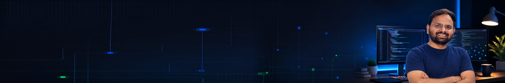

  

# Rohit Patel

**Full-Stack Developer | Node.js · React · MySQL . AWS . GenAI . AI Engineer . RAG . Genrative AI . Agentic AI**

I develop web applications, investigate production issues, and work on making deployments easier to understand and maintain.

## About Me

- I work across React frontends, Node.js APIs, and MySQL databases.
- I enjoy tracing issues from the user interface through backend services to the data behind them.
- My experience includes multi-tenant applications, background jobs, and production support.
- I also work with deployment documentation, knowledge transfer, and infrastructure inventories.

## What I Work On

- **Frontend development:** React interfaces, application workflows, and UI fixes.
- **Backend development:** Node.js APIs, validation, and application logic.
- **Data and background processing:** MySQL, Redis, and Bull queues.
- **Production support:** Troubleshooting, deployment preparation, and service verification.

## Tech I Use

  
  
  
  
  
  
  
  
  
  
  
  
  
  

| Area | Technologies and tools |
| --- | --- |
| Core development | JavaScript, React, Node.js, MySQL |
| Data and jobs | Sequelize, Redis, Bull |
| Development tools | Git, Docker, VS Code, Cursor |
| Deployment and infrastructure exposure | AWS EC2, Cloudflare, PM2, Linux |

## Featured Work

My recent work spans these areas:

| Area | My contribution |
| --- | --- |
| Multi-tenant web applications | Maintenance and issue investigation across frontend, API, and database layers. |
| Data accuracy | Investigating aggregate calculations and correcting backend logic. |
| Background processing | Troubleshooting queues, scheduled jobs, and asynchronous workflows. |
| Deployment readiness | Documenting deployment steps, dependencies, and verification checks. |

<!-- Add your own public project links here when you are ready. -->

## Current Focus

- Deepening my understanding of backend architecture and database performance.
- Improving deployment reliability and operational documentation.
- Building maintainable applications with clear, predictable behavior.

## Connect

Feel free to explore my repositories and connect through the links on my GitHub profile.

<!-- Optional: add your actual LinkedIn, portfolio, and contact links here. -->

---

*Practical solutions. Clear code. Continuous learning.*

<!-- Section structure inspired by https://github.com/TusharVashishth/TusharVashishth; profile content personalized for Rohit Patel. -->
